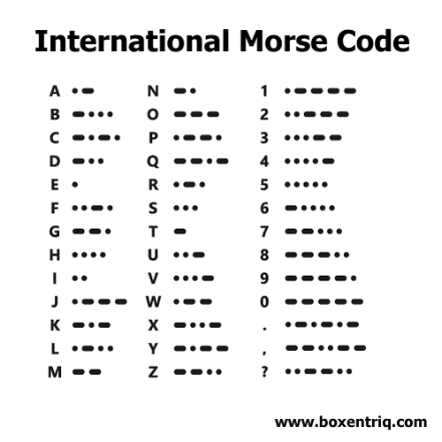
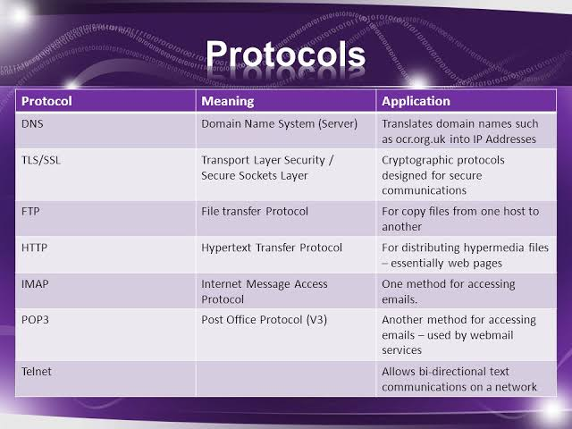
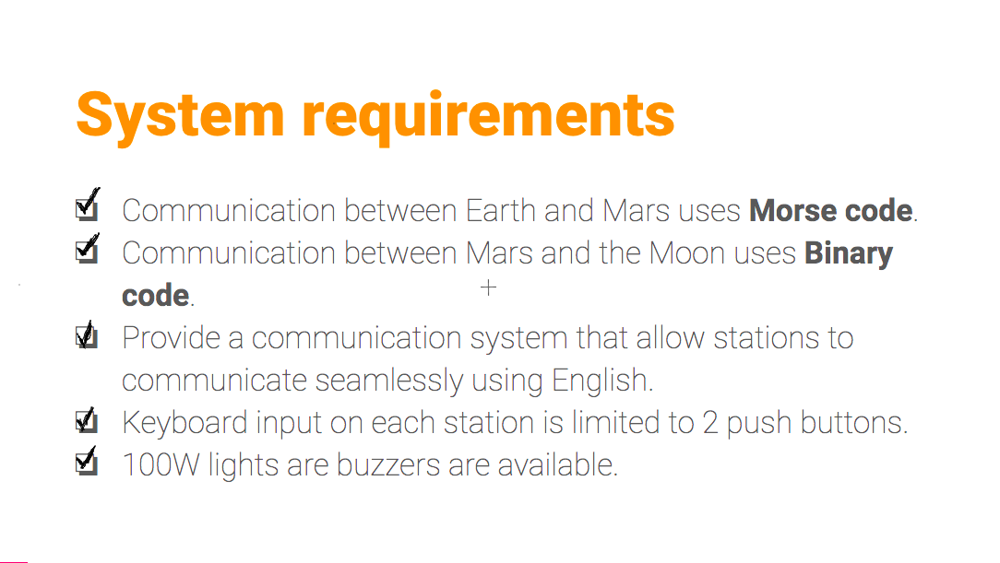

# unit-2-repository
This is for Unit 2
## Design
The year is 2050. Planet exploration is a thing, however, communication is still precarious. The station in the Earth can only communicate using Morse code, the station in the Moon can only communicate in Binary code. Communication with the station in Mars must be provided. 

In order to fulfill the needs of communication by creating a simple use bash program. The program should be user friendly and it must satisfy the success criteria (Listed below).
*Communication between Earth and Mars uses Morse code.
*Communication between Mars and the Moon uses Binary code.
*Provide a communication system that allow stations to communicate seamlessly using English.
*Keyboard input on each station is limited to 2 push buttons. 
*100W lights are buzzers are available.

The program will run Modern C. Moreover, there are couple of differences between Bash and Modern C.
Firstly, the syntax is different. While little errors will completely stop the program in Bash, Modern C allows small erorros.
Secondly, The resource you can find online dramatically increases switching from Bash to Arduino. This can be because Modern C is more of a popular coding language.
Lastly, Arduino has its own hardare while bash is integrated with the PC. While this is good, the Arduino can't operate in the OS.

Obtaining a basic understanding or Modern C is essential to being able to design an effective system which can translate binary, English, and morse code. In order to get started with this, let's take a look at the different types of integers within Modern C: 

*A boolean is a variable which can only hold two values, true or false which only uses 1 byte. 
*A float is a number which has a decimal point which is stored as 4 bytes. 
*A word stores an unsigned number from 0 to 65,535. A long is an extended numerical variable which covers from -2,147,483,648 to 2,147,483,647. 
*A char stores a single character as a value. 
*An unsigned char encodes numbers from 0 to 255. 
*An int stores an integer from -32,768 to 32,767. 
*An unsigned int is the same as an int yet it lacks the negative values, resulting in it ranging from 0 to 65,535.

These eight types of variables enable us to cast a wide net and find a variable which meets 
our own particular needs. While some of they may be multifunctional, it is best to find the one 
best directed for our needs in order to minimize the memory used storing our variable.
Another interesting function with Modern C is "void," used for declaring functions. It ensures 
that the function is expected not to have an output back to its original function.


### Usability
What is usability?
ISO defines usability as "The extent to which a product can be used by specified users to achieve specified goals with effectiveness, efficiency, and satisfaction in a specified context of use."


## Development

### Using for loops in Arduino

```.c
void setup()
{
  pinMode(11, OUTPUT);
  pinMode(10, OUTPUT);
  pinMode(9, OUTPUT);
}

void loop()
{
  for(int x=11; x>=9; x --){
  	digitalWrite(x, HIGH);
  	delay(1000); // Wait for 1000 millisecond(s)
  	digitalWrite(x, LOW);
  	delay(1000); // Wait for 1000 millisecond(s)
  }
}
```
### Counting from 10 to 15 in Binary
When we write in Decimals, after we reach 9, we add 1 to the begining and add 0. In binary it is the same. It starts with 0, 1 and the number that comes after is 10. When we come to this point we start adding 1's, so the next number is 11. Then again we reached the 1 limit so we have to add 0's and start again, thus, the next numbers are 100, 101, 110, 111, 1000. So in the scope of this, 15 is going to be 1111. In order to count in Binary with LED lights, we need 4 LED lights. I set up 4 lights that will work independentaly. I coded the LEDs with the help of modules. I set up a for loop from 1 to 15 and under that I devided every light in 4 section A,B,C,D respectively. For the D section I got module 2 and if it's greater than 0 it will light up. For C I got module 4 and if it's greater than 1, it will light up. For the B section, I got module 8 so if the number is greater than 3 it will light up. And finally I got module 16 on A section so it will light up if it's greater than 8.


### Convertion from decimal to seven segment number:
The program we want to create is based upon numbers. Thusly, learning this converstion and learning the logic gates to
decode and turn it into a program is essential.\

Firtly we make a logic table based on the number of outputs.
Secondly we use logic gates that we learned in class to turn it into an equation.
Lastly, we use the equation to light up the outputs in a wanted arrangement.

#### What you need:

Logical Gates:

From this, you can costruct a truth table and create an equation

Lights:

To display your code.

``` .c
int butA = 11;
int butB = 10;
int butC = 9;
int outa = 7;
int outb = 6;
int outc = 5;
int outd = 4;
int oute = 3;
int outf = 2;
int outg = 1;
void setup()
{
  pinMode(outa, OUTPUT);
  pinMode(outb, OUTPUT);
  pinMode(outc, OUTPUT);
  pinMode(outd, OUTPUT);
  pinMode(oute, OUTPUT);
  pinMode(outf, OUTPUT);
  pinMode(outg, OUTPUT);
  pinMode(butA, INPUT);
  pinMode(butB, INPUT);
  pinMode(butC, INPUT);
}

void loop()
{
  bool A = digitalRead(butA);
  bool B = digitalRead(butB);
  bool C = digitalRead(butC);
  
  
  bool eqA = (!C&&!A)||B||(C&&A);
  digitalWrite(outa, eqA);
  bool eqB = (!B&&!C)||(A&&!C)||(A&&!B);
  digitalWrite(outb, eqB);
  bool eqC = (!A&&!C)||(B&&!C);
  digitalWrite(outc, eqC);
  bool eqD = (!A&&!C)||(!A&&B)||(B&&!C)||(A&&!B&&C);
  digitalWrite(outd, eqD);
  bool eqE = (!A&&!B)||(!A&&C)||A;
  digitalWrite(oute, eqE);
  bool eqF = !A||(!B&&!C)||(B&&C);
  digitalWrite(outf, eqF);
  bool eqG = (B&&!C)||(!A&&B)||(A&&!C)||(A&&!B);
  digitalWrite(outg, eqG);
``` 
    `


### Input system: English
In order to comprehence what our system does first we need to know what morse alphabet is.
Morse code is a method of sending text messages by keying in a series of electronic pulses, usually represented as a short pulse (called a "dot") and a long pulse (a "dash"). The code was devised by Samuel F. B. Morse in the 1840s to work with his invention of the telegraph, the first invention to effectively exploit electromagnetism for long-distance communication. The early telegrapher, often one who was at a railroad station interconnected with others along miles of telegraph pole lines, would tap a key up and down to send a succession of characters that the receiving telegrapher could read from tape (later operators learned to read the transmissions simply by listening). In the original version, the key down separated by a pause (key up) from the next letter was a dot (or, as it sounded to the telegrapher, a "dit") and the key down quickly twice in succession was a dash (a "dah" or "dit-dit"). Each text character was represented by a dot, dash, or some combination.

Here is an example of the morse alphabet


### System ideas
We have 2 buttons, I want to define 1 button as "next letter" and other button as "accept letter".
*Update: Instead of defining as next letter and accept letter, I will display every input for some time and define buttons as "Delete" and "Accept"* The program will display the english alphabet, space and numbers 0-9.
*We decided to scratch that idea too, the final decicion can be seen below.

### What we finally decided on doing the system
Since we have some limitations for the program we had to come up with a solution that is
*1) Successfully completes the criteria*
*2) Usable by all users who are able to press a button*
*3) Make it realistic so we have an idea on how to do it*
*4) Have some add-ons like "Delete, Reset, Send"*
By the end of our discussion, we decided that the best way of programing this would be by having two buttons, LCD and 2 Output (Light sources)
So our plan was to make a string and put all the alphabet to the string. In addition, the string will consist actions like "DELETE, RESET and SEND) There are two buttons: One button is used to cycle through the srting and the other one is to confirm the input LCD is on. Moreover, once you press "SEND" The input shown in the display will light up as morse code, which can be examined through the LED's.
### Manual:
Button A: This button is used to confirm the string LCD is on
Button B: Cycles through the string (Can be seen through the LCD)
LCD: Displays the strings and shows the actions
LED Lights: Displays English input in Morse code through lighting up

### Protocols
In order to plan out our system in detail, we needed to have protocols. But first what are protocols?:

Protocol, in computer science, a set of rules or procedures for transmitting data between electronic devices, such as computers. In order for computers to exchange information, there must be a preexisting agreement as to how the information will be structured and how each side will send and receive it.


*This is an example of protocols we learn in class.
### The protocols we ended up using in our system:
1. A dash is three seconds (light on) 
2. Between parts of letter is one second (light off)
3. Between letters is two second (light off)
4. Between words is 4 seconds (light off)
5. Indicate the beginning and end of a message it’ll flash five times (for half a second per flash) (light on)
6. A dot is lighting the led for 1 second (light on)

### Coding of English to Morse
```// This program converts English into morse code, communicated through two LEDs. Both LEDs being on represents a dash while one LED represents a dot. 

#include <LiquidCrystal.h>
int index = 0; 
// add all the letters and digits to the keyboard
String keyboard[]={"A", "B", "SENT", "C", "D", "E", "F", "G", "H", "I", "J", "K", "L", "M", "N", "O", "P", "Q", "R", "S", "T", "U", "V", "W", "X", "Y", "Z", "DEL"};
String text = "";
int numOptions = 28;
int i = 0;

// initialize the library with the numbers of the interface pins
LiquidCrystal lcd(12, 11, 5, 4, 9, 8);

void setup() {
  Serial.begin(9600);
  pinMode(13, OUTPUT);
  pinMode(10, OUTPUT);
  // set up the LCD's number of columns and rows:
  lcd.begin(16, 2);
  // Print a message to the LCD.
  attachInterrupt(0, changeLetter, RISING); //button A in port 2
  attachInterrupt(1, selected, RISING); //button B in port 3
}

void loop() {
  // set the cursor to column 0, line 1
  // (note: line 1 is the second row, since counting begins with 0):
  lcd.clear();
  lcd.setCursor(0, 0);
  lcd.print(keyboard[index]);
  lcd.setCursor(0, 1);
  lcd.print(text);
  delay(100);
}

//This function changes the letter in the keyboard
void changeLetter(){
  static unsigned long last_interrupt_time = 0;
  unsigned long interrupt_time = millis();
  if (interrupt_time - last_interrupt_time > 200)
  {
  
    last_interrupt_time = interrupt_time;// If interrupts come faster than 200ms, assum
    index++;
      //check for the max row number
    if(index==numOptions){
      index=0; //loop back to first row
    } 
 }
}

//this function adds the letter to the text or send the msg
void selected(){
  static unsigned long last_interrupt_time = 0;
  unsigned long interrupt_time = millis();
  if (interrupt_time - last_interrupt_time > 200)
  {
  
    last_interrupt_time = interrupt_time;// If interrupts come faster than 200ms, assum
    
    String key = keyboard[index];
    if (key == "DEL")
    {
      int len = text.length();
      text.remove(len-1);
    }
    else if(key == "SENT")
    {
      sent(); // addition of sent(); redirects program to separate function, causing translation to initiate
      text=""; // all of the code up until this section is the exact same as from the English input system detailed above
    }
    else{
      text += key;
    }
    index = 0; //restart the index
  }
}
 
void sent() { // defining sent function
      
int strLen = text.length(); // setting len to length to text
for (int i = 0; i < strLen; i++) {  // cycling through each letter of text 
  switch (text.charAt(i)) { // translating for i’th letter
 
case 'A': // each case is checking if the letter of the "text" string is equal to itself. if it is, it will perform the actions. for example, if the letter were equal to A, it would perform the functions dot, dash, and wait.
  dot();
  dash();
  wait();
  break;
case 'B':
  dash();
  dot();
  dot();
  dot();
  wait();
  break;
case 'C': 
  dash();
  dot();
  dash();
  dot();
  wait();
  break;
case 'D':
  dash();
  dot();
  dot();
  wait();
  break;
case 'E':
  dot();
  wait();
  break;
case 'F': 
  dot();
  dot();
  dash();
  dot();
  wait();
  break;
case 'G':
  dash();
  dash();
  dot();
  wait();
  break;
case 'H':
  dot();
  dot();
  dot();
  dot();
  wait();
  break;
case 'I':
  dot();
  dot();
  wait();
  break;
case 'J':
  dot();
  dash();
  dash();
  dash();
  wait();
  break;
case 'K':
  dash();
  dot();
  dash();
  wait();
  break;
case 'L':
  dot();
  dash();
  dot();
  dot();
  wait();
  break;
case 'M':
  dash();
  dash();
  wait();
  break;
case 'N':
  dash();
  dot();
  wait();
  break;
case 'O':
  dash();
  dash();
  dash();
  wait();
  break;
case 'P':
  dot();
  dash();
  dash();
  dot();
  wait();
  break;
case 'Q':
  dash();
  dash();
  dot();
  dash();
  wait();
  break;
case 'R':
  dot();
  dash();
  dot();
  wait();
  break;
case 'S':
  dot();
  dot();
  dot();
  wait();
  break;
case 'T':
  dash();
  wait();
  break;
case 'U':
  dot();
  dot();
  dash();
  wait();
  break;
case 'V':
  dot();
  dot();
  dot();
  dash();
  wait();
  break;
case 'W':
  dot();
  dash();
  dash();
  wait();
  break;
case 'X':
  dash();
  dot();
  dot();
  dash();
  wait();
  break;
case 'Y':
  dash();
  dot();
  dash();
  dash();
  wait();
  break;
case 'Z': 
  dash();
  dash();
  dot();
  dot();
  wait();
  break; 
case ' ':
  digitalWrite(13, LOW);
  delay(4000);
if (i < strLen - 1) {  // when all letters have been translated, the sent function is complete
 Serial.print("done");
} 
  }}}

void dot() {  // defining the dot function as one light being on
Serial.print("dot ");
digitalWrite(13, HIGH);
delay(1000);
digitalWrite(13, LOW);
delay(1000);
}

void dash() { // defining the dash function as both lights being on
Serial.print("dash ");
digitalWrite(13, HIGH);
digitalWrite(10, HIGH);
delay(3000);
digitalWrite(13, LOW);
digitalWrite(10, LOW);
delay(1000);
}

void wait() { // defining the wait function 
  delay(3000); // between letters is three second delay
} 
```
### Explanation of the code:
Since the English input system was given to us by our teacher, the only thing left for us to do was implementing a system that translates English to Morse.

We started by defining a "Sent" button. 
` else if(key == "SENT")
    {
      sent(); // addition of sent(); redirects program to separate function, causing translation to initiate
      text=""; // all of the code up until this section is the exact same as from the English input system detailed above
    }
 `
 When the sent button is pressed, first the program is linked to another function.
 `
 void sent() { // defining sent function
      
int strLen = text.length(); // setting len to length to text
for (int i = 0; i < strLen; i++) {  // cycling through each letter of text 
  switch (text.charAt(i)) { // translating for i’th letter `
  This function is used to translate the English input that is typed by the user by the two button keyboard into Morse. When this button is pressed, the outcome will be: The light flashing up in morse code that displays the message.
  The for loop can be seen as the cycle of each letter. Every time the button B is pressed, the for loop functions so that the string displayed at the LCD is cycled.
  The switch code is used to translate the defined characters the LCD is displaying.
  `case 'A': // each case is checking if the letter of the "text" string is equal to itself. if it is, it will perform the actions. for example, if the letter were equal to A, it would perform the functions dot, dash, and wait.
  dot();
  dash();
  wait();
  break;
  `
  This is an example of a case. We found using cases the most efficient ,even though later on in Morse to English we are going to switch to if commands. Defining the cases was easy because instead of putting all the commands to every string, we decided that we will have all of the actions in voids.
  `void dot() {  // defining the dot function as one light being on
Serial.print("dot ");
digitalWrite(13, HIGH);
delay(1000);
digitalWrite(13, LOW);
delay(1000);
}

void dash() { // defining the dash function as both lights being on
Serial.print("dash ");
digitalWrite(13, HIGH);
digitalWrite(10, HIGH);
delay(3000);
digitalWrite(13, LOW);
digitalWrite(10, LOW);
delay(1000);
}

void wait() { // defining the wait function 
  delay(3000); // between letters is three second delay
}
`
This is an example on how we defined every action. This is a very efficient way to reduce lines in a system.
  
### Input system: Morse to English
After finishing the english input system, the morse input system was relatively easier. In order to complete the morse to english system we decided to replace the english input system strings with the morse alphabet. The structure of the code is very similar to the English input system. In addition, a major difference between two systems is what we used to define letters/code. In english to morse system we used cases, whilst in morse to english, we used if, else and else if commands.

The script below is our morse to english system:
```.c
// This program converts Morse code to English using an LCD display. 

// include the library code:
#include <LiquidCrystal.h>
int index = 0; 
String keyboard[]={"RESET", ".-", "-...","-.-.", "-..", ".", "..-.", "--.", "....", "..", ".---", "-.-", ".-..", "--", "-.", "---", ".--.", "--.-", ".-.", "...", "-", "..-", "...-", ".--", "-..-", "-.--", "--..", "DEL"}; // here, we edited the keyboard to have the words in morse rather than in a traditional English alphabet
String text = "";
String chosen = "";
int numOptions = 29;
int i = 0;

// initialize the library with the numbers of the interface pins
LiquidCrystal lcd(12, 11, 5, 4, 9, 8);

void setup() {
  Serial.begin(9600);
  pinMode(13, OUTPUT);
  pinMode(10, OUTPUT);
  // set up the LCD's number of columns and rows:
  lcd.begin(16, 2);
  // Print a message to the LCD.
  attachInterrupt(0, changeLetter, RISING);//button A in port 2
  attachInterrupt(1, selected, RISING);//button B in port 3
}

void loop() {
  // set the cursor to column 0, line 1
  // (note: line 1 is the second row, since counting begins with 0):
  lcd.clear();
  lcd.setCursor(0, 0);
  lcd.print(keyboard[index]);
  lcd.setCursor(0, 1);
  lcd.print(chosen); // printing the translated/chosen string on the second line of the LCD
  delay(100);
}

//This function changes the letter in the keyboard
void changeLetter(){
  static unsigned long last_interrupt_time = 0;
  unsigned long interrupt_time = millis();
  if (interrupt_time - last_interrupt_time > 200)
  {
  
    last_interrupt_time = interrupt_time;// If interrupts come faster than 200ms, assum
    index++;
      //check for the max row number
    if(index==numOptions){
      index=0; //loop back to first row
    } 
 }
}

//this function adds the letter to the text or send the msg
void selected(){
  static unsigned long last_interrupt_time = 0;
  unsigned long interrupt_time = millis();
  if (interrupt_time - last_interrupt_time > 200)
  {
  
    last_interrupt_time = interrupt_time;// If interrupts come faster than 200ms, assum
    
    String key = keyboard[index];
    if (key == "DEL")
    {
      int len = text.length();
      text.remove(len-1);
    }
    else if (key == "RESET")
    {
      chosen = ""; //resets chosen string to nothing, effectively resetting the system
    }
    else{
      text += key; // immediately converts the letter whenever it is added
      convert(); // up until here, the system is very similar to the English input system in the method of inputting letters
    }
    index = 0; //restart the index
  }
}

void convert() { // defining the conversion/translation function 
  if (text == ".-" ) { // if else statements used because switch cases proved difficult when comparing entire strings
    String key = "A"; // if text = .-, then the letter is A. adds A to the chosen string, displayed immediately on the second row of the LCD
    chosen += key;
  }
  else if (text == ".-" ) { // repreats for every letter
    String key = "B"; 
    chosen += key;
  }
  else if (text == "-.-.") {
    String key = "C"; 
    chosen += key;
  }
  else if (text == "-..") {
    String key = "D"; 
    chosen += key;
  }
  else if (text == ".") {
    String key = "E"; 
    chosen += key;
  }
  else if (text == "..-.") {
    String key = "F"; 
    chosen += key;
  }
  else if (text == "--.") {
    String key = "G";
    chosen += key;    
  }
  else if (text == "....") {
    String key = "H"; 
    chosen += key;
  }
  else if (text == "..") {
    String key = "I"; 
    chosen += key;
  }
  else if (text == ".---") {
    String key = "J"; 
    chosen += key;
  }
  else if (text == "-.-") {
    String key = "K"; 
    chosen += key;
  }
  else if (text == ".-..") {
    String key = "L"; 
    chosen += key;
  }
  else if (text == "--") {
    String key = "M"; 
    chosen += key;
  }
  else if (text == "-.") {
    String key = "N"; 
    chosen += key;
  }
  else if (text == "---") {
    String key = "O"; 
    chosen += key;
  }
  else if (text == ".-" ) {
    String key = "P"; 
    chosen += key;
  }
  else if (text == "-.-.") {
    String key = "Q"; 
    chosen += key;
  }
  else if (text == "-..") {
    String key = "R"; 
    chosen += key;
  }
  else if (text == ".") {
    String key = "S"; 
    chosen += key;
  }
  else if (text == "..-.") {
    String key = "T"; 
    chosen += key;
  }
  else if (text == "--.") {
    String key = "U"; 
    chosen += key;
  }
  else if (text == "...-") {
    String key = "V"; 
    chosen += key;
  }
  else if (text == ".--") {
    String key = "W"; 
    chosen += key;
  }
  else if (text == "-..-") {
    String key = "X"; 
    chosen += key;
  }
  else if (text == "-.--") {
    String key = "Y";
    chosen += key;
  }
  else if (text == "--..") {
    String key = "Z";
    chosen += key; 
  }
  text = ""; // resets text at the end of each translation in order to prevent repetition of letters
}
````
Moreover, the arduino set-up we used is the completely same with the English input system.
The image of the Arduino:


The system works with the same two buttons; button b switchs between the string ( in this case the morse alphabet) and button a confirms the srting you are on. For instance, if you want to write cab, you will have to pick morse alphabet c by pressing button b 2 times, then press button a; press button b once and then a; and only a. If you want to delete/reset/send, press button b until you reach those strings and as seen from the code, pressing button a will confirm and do it.

For less complication, here is a GIF showing how the Morse to English system works:


As seen, the system works perfectly.


## Errors/Mistakes
Even though the programs does the task without a errors something that we can improve is the system we made are open for mistakes. The two button system limits on the inputting part of the program, making it complicated for some users. The work/result is much more lower than a system that allows an actual keyboard. In order to reduce the concenquences of the faulty usability, we put a reset button and a delete button. This buttons helps us a lot when it comes to mistakes. Moreover, we used different deleting options in the two different systems

For the English to Morse system, we used Delete:
''''
 
    String key = keyboard[index];
    if (key == "DEL")
    {
      int len = text.length();
      text.remove(len-1); '''' 

We started by adding the string "DEL" (for delete) to the keyboard. After we added it, we used an if command to put it in action. If the DEL button is pressed, it will remove 1 letter from the text.length() (which is the text that appears on the LCD). We decided this would be enough because everything is written letter by letter.

For the Morse to English system;
`
else if (key == "RESET")
    {
      chosen = ""; //resets chosen string to nothing, effectively resetting the system
    }
    else{
      text += key; // immediately converts the letter whenever it is added
      convert(); // up until here, the system is very similar to the English input system in the method of inputting letters
    }
    index = 0; //restart the index `

We decided to take a difference approach. While writing morse, you don't write letter by letter, rather you write couple of symbols together. We thought it would be inefficient to delete each symbol one by one because that would take an excessive amount of time to delete all of it. Thus, we put a reset button instead. First we added the rest button to the string. After defining it we made it an else if command and, if the RESET button is pressed, it clears up the whole inputs that were added to the LCD.

The reset button in action:


As seen, the reset button clears everthing, making it easier to delete.
## Testing
All of the works mentioned in this README file and more of the tests are uploaded to youtube.
### English to Morse:
In this test we wrote "TEST" to the keyboard system and pressed send. This video evidence shows that the system is working perfectly fine and when it is connected to a light source, the source plays the input in Morse alphabet.
The link to the video:
https://www.youtube.com/watch?v=HkToqDY9gbA&list=PLS6syomu_xC6TR8MhTaBuTHIIJVKAyJ-w&index=2&t=0s

### Morse to English:
In this video evidence we used the morse code "-.-..--..." .The translation of this morse code is "CAB" and we got correct result. Afterwards we pressed DEL to delete a letter which worked (CA). Finally, we pressed the reset button which cleared all the inputs
The link the video:
https://www.youtube.com/watch?v=nQMU-dAM5Pw&list=PLS6syomu_xC6TR8MhTaBuTHIIJVKAyJ-w&index=3&t=0s

## Evaluation
(The image of the system requirments marked with the ones we have completed successfully)

As seen from the table, we have met all of the system requirements successfully. Although there can be some improvements made, ultimately, the program fulfills the success criteria. The communication between two of the planets were possible which was our most important goal. The usability can be improved but for now, everything is completed and there are no errors in the functioning.

## Citation
Rouse, Margaret. “What Is Morse Code? - Definition from WhatIs.com.” SearchNetworking, TechTarget, 21 Sept. 2005, searchnetworking.techtarget.com/definition/Morse-code.

The Editors of Encyclopaedia Britannica. “Protocol.” Encyclopædia Britannica, Encyclopædia Britannica, Inc., 31 Aug. 2018, www.britannica.com/technology/protocol-computer-science.


Person, and wikiHow. “How to Convert from Binary to Decimal.” WikiHow, WikiHow, 12 Nov. 2019, www.wikihow.com/Convert-from-Binary-to-Decimal.

“Demystify Using Arrays with Arduino by Watching This Indpeth Video Tutorial.” Programming Electronics Academy, 31 Oct. 2018, www.programmingelectronics.com/tutorial-13-how-to-use-arrays-with-arduino/.

“Usability.” Usability - Computer Science Wiki, computersciencewiki.org/index.php/Usability.

“Switch...case.” Arduino Reference, www.arduino.cc/reference/en/language/structure/control-structure/switchcase/.

