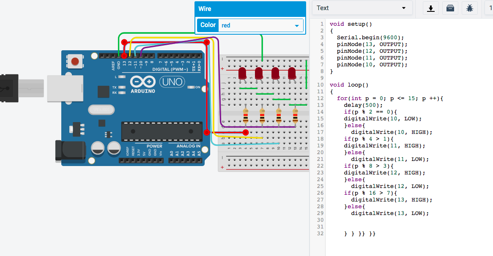
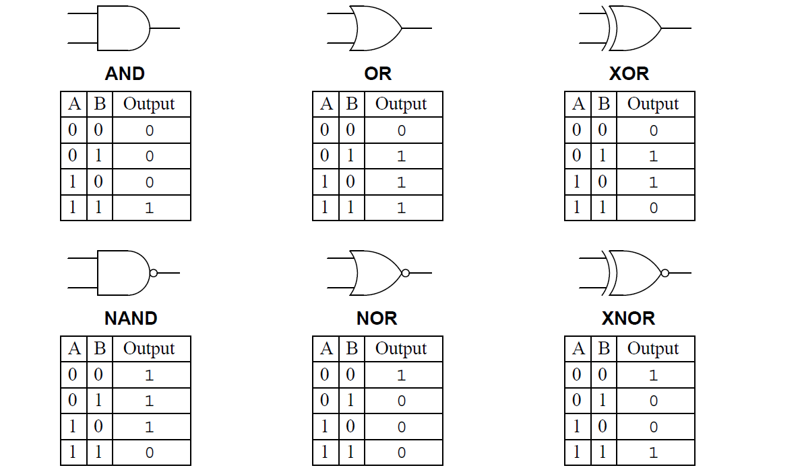
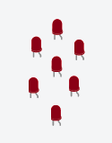
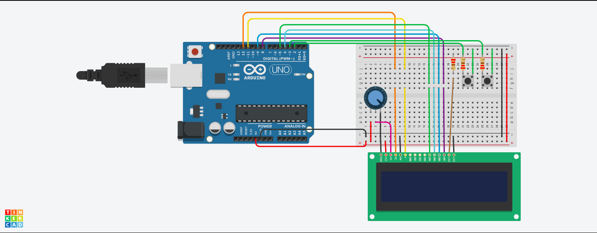

# unit-2-repository
This is for Unit 2
## Design
The year is 2050. Planet exploration is a thing, however, communication is still precarious. The station in the Earth can only communicate using Morse code, the station in the Moon can only communicate in Binary code. Communication with the station in Mars must be provided. 

In order to fulfill the needs of communication by creating a simple use bash program. The program should be user friendly and it must satisfy the success criteria (Listed below).
*Communication between Earth and Mars uses Morse code.
*Communication between Mars and the Moon uses Binary code.
*Provide a communication system that allow stations to communicate seamlessly using English.
*Keyboard input on each station is limited to 2 push buttons. 
*100W lights are buzzers are available.

The program will run Modern C. Moreover, there are couple of differences between Bash and Modern C.
Firstly, the syntax is different. While little errors will completely stop the program in Bash, Modern C allows small erorros.
Secondly, The resource you can find online dramatically increases switching from Bash to Arduino. This can be because Modern C is more of a popular coding language.
Lastly, Arduino has its own hardare while bash is integrated with the PC. While this is good, the Arduino can't operate in the OS.

Obtaining a basic understanding or Modern C is essential to being able to design an effective system which can translate binary, English, and morse code. In order to get started with this, let's take a look at the different types of integers within Modern C: 

*A boolean is a variable which can only hold two values, true or false which only uses 1 byte. 
*A float is a number which has a decimal point which is stored as 4 bytes. 
*A word stores an unsigned number from 0 to 65,535. A long is an extended numerical variable which covers from -2,147,483,648 to 2,147,483,647. 
*A char stores a single character as a value. 
*An unsigned char encodes numbers from 0 to 255. 
*An int stores an integer from -32,768 to 32,767. 
*An unsigned int is the same as an int yet it lacks the negative values, resulting in it ranging from 0 to 65,535.

These eight types of variables enable us to cast a wide net and find a variable which meets 
our own particular needs. While some of they may be multifunctional, it is best to find the one 
best directed for our needs in order to minimize the memory used storing our variable.
Another interesting function with Modern C is "void," used for declaring functions. It ensures 
that the function is expected not to have an output back to its original function.


### Usability
What is usability?
ISO defines usability as "The extent to which a product can be used by specified users to achieve specified goals with effectiveness, efficiency, and satisfaction in a specified context of use."


## Development

### Using for loops in Arduino

```.c
void setup()
{
  pinMode(11, OUTPUT);
  pinMode(10, OUTPUT);
  pinMode(9, OUTPUT);
}

void loop()
{
  for(int x=11; x>=9; x --){
  	digitalWrite(x, HIGH);
  	delay(1000); // Wait for 1000 millisecond(s)
  	digitalWrite(x, LOW);
  	delay(1000); // Wait for 1000 millisecond(s)
  }
}
```
### Counting from 10 to 15 in Binary
When we write in Decimals, after we reach 9, we add 1 to the begining and add 0. In binary it is the same. It starts with 0, 1 and the number that comes after is 10. When we come to this point we start adding 1's, so the next number is 11. Then again we reached the 1 limit so we have to add 0's and start again, thus, the next numbers are 100, 101, 110, 111, 1000. So in the scope of this, 15 is going to be 1111. In order to count in Binary with LED lights, we need 4 LED lights. I set up 4 lights that will work independentaly. I coded the LEDs with the help of modules. I set up a for loop from 1 to 15 and under that I devided every light in 4 section A,B,C,D respectively. For the D section I got module 2 and if it's greater than 0 it will light up. For C I got module 4 and if it's greater than 1, it will light up. For the B section, I got module 8 so if the number is greater than 3 it will light up. And finally I got module 16 on A section so it will light up if it's greater than 8.


### Convertion from decimal to seven segment number:
The program we want to create is based upon numbers. Thusly, learning this converstion and learning the logic gates to
decode and turn it into a program is essential.\

Firtly we make a logic table based on the number of outputs.
Secondly we use logic gates that we learned in class to turn it into an equation.
Lastly, we use the equation to light up the outputs in a wanted arrangement.

#### What you need:

Logical Gates:

From this, you can costruct a truth table and create an equation

Lights:

To display your code.

``` .c
int butA = 11;
int butB = 10;
int butC = 9;
int outa = 7;
int outb = 6;
int outc = 5;
int outd = 4;
int oute = 3;
int outf = 2;
int outg = 1;
void setup()
{
  pinMode(outa, OUTPUT);
  pinMode(outb, OUTPUT);
  pinMode(outc, OUTPUT);
  pinMode(outd, OUTPUT);
  pinMode(oute, OUTPUT);
  pinMode(outf, OUTPUT);
  pinMode(outg, OUTPUT);
  pinMode(butA, INPUT);
  pinMode(butB, INPUT);
  pinMode(butC, INPUT);
}

void loop()
{
  bool A = digitalRead(butA);
  bool B = digitalRead(butB);
  bool C = digitalRead(butC);
  
  
  bool eqA = (!C&&!A)||B||(C&&A);
  digitalWrite(outa, eqA);
  bool eqB = (!B&&!C)||(A&&!C)||(A&&!B);
  digitalWrite(outb, eqB);
  bool eqC = (!A&&!C)||(B&&!C);
  digitalWrite(outc, eqC);
  bool eqD = (!A&&!C)||(!A&&B)||(B&&!C)||(A&&!B&&C);
  digitalWrite(outd, eqD);
  bool eqE = (!A&&!B)||(!A&&C)||A;
  digitalWrite(oute, eqE);
  bool eqF = !A||(!B&&!C)||(B&&C);
  digitalWrite(outf, eqF);
  bool eqG = (B&&!C)||(!A&&B)||(A&&!C)||(A&&!B);
  digitalWrite(outg, eqG);
``` 
    `


### Input system: English
We have 2 buttons, I want to define 1 button as "next letter" and other button as "accept letter".
*Update: Instead of defining as next letter and accept letter, I will display every input for some time and define buttons as "Delete" and "Accept"* The program will display the english alphabet, space and numbers 0-9.


### Input system: Morse to English
After finishing the english input system, the morse input system was relatively easier. In order to complete the morse to english system we decided to replace the english input system strings with the morse alphabet. The structure of the code is very similar to the English input system. In addition, a major difference between two systems is what we used to define letters/code. In english to morse system we used cases, whilst in morse to english, we used if, else and else if commands.

The script below is our morse to english system:
```.c
// This program converts Morse code to English using an LCD display. 

// include the library code:
#include <LiquidCrystal.h>
int index = 0; 
String keyboard[]={"RESET", ".-", "-...","-.-.", "-..", ".", "..-.", "--.", "....", "..", ".---", "-.-", ".-..", "--", "-.", "---", ".--.", "--.-", ".-.", "...", "-", "..-", "...-", ".--", "-..-", "-.--", "--..", "DEL"}; // here, we edited the keyboard to have the words in morse rather than in a traditional English alphabet
String text = "";
String chosen = "";
int numOptions = 29;
int i = 0;

// initialize the library with the numbers of the interface pins
LiquidCrystal lcd(12, 11, 5, 4, 9, 8);

void setup() {
  Serial.begin(9600);
  pinMode(13, OUTPUT);
  pinMode(10, OUTPUT);
  // set up the LCD's number of columns and rows:
  lcd.begin(16, 2);
  // Print a message to the LCD.
  attachInterrupt(0, changeLetter, RISING);//button A in port 2
  attachInterrupt(1, selected, RISING);//button B in port 3
}

void loop() {
  // set the cursor to column 0, line 1
  // (note: line 1 is the second row, since counting begins with 0):
  lcd.clear();
  lcd.setCursor(0, 0);
  lcd.print(keyboard[index]);
  lcd.setCursor(0, 1);
  lcd.print(chosen); // printing the translated/chosen string on the second line of the LCD
  delay(100);
}

//This function changes the letter in the keyboard
void changeLetter(){
  static unsigned long last_interrupt_time = 0;
  unsigned long interrupt_time = millis();
  if (interrupt_time - last_interrupt_time > 200)
  {
  
    last_interrupt_time = interrupt_time;// If interrupts come faster than 200ms, assum
    index++;
      //check for the max row number
    if(index==numOptions){
      index=0; //loop back to first row
    } 
 }
}

//this function adds the letter to the text or send the msg
void selected(){
  static unsigned long last_interrupt_time = 0;
  unsigned long interrupt_time = millis();
  if (interrupt_time - last_interrupt_time > 200)
  {
  
    last_interrupt_time = interrupt_time;// If interrupts come faster than 200ms, assum
    
    String key = keyboard[index];
    if (key == "DEL")
    {
      int len = text.length();
      text.remove(len-1);
    }
    else if (key == "RESET")
    {
      chosen = ""; //resets chosen string to nothing, effectively resetting the system
    }
    else{
      text += key; // immediately converts the letter whenever it is added
      convert(); // up until here, the system is very similar to the English input system in the method of inputting letters
    }
    index = 0; //restart the index
  }
}

void convert() { // defining the conversion/translation function 
  if (text == ".-" ) { // if else statements used because switch cases proved difficult when comparing entire strings
    String key = "A"; // if text = .-, then the letter is A. adds A to the chosen string, displayed immediately on the second row of the LCD
    chosen += key;
  }
  else if (text == ".-" ) { // repreats for every letter
    String key = "B"; 
    chosen += key;
  }
  else if (text == "-.-.") {
    String key = "C"; 
    chosen += key;
  }
  else if (text == "-..") {
    String key = "D"; 
    chosen += key;
  }
  else if (text == ".") {
    String key = "E"; 
    chosen += key;
  }
  else if (text == "..-.") {
    String key = "F"; 
    chosen += key;
  }
  else if (text == "--.") {
    String key = "G";
    chosen += key;    
  }
  else if (text == "....") {
    String key = "H"; 
    chosen += key;
  }
  else if (text == "..") {
    String key = "I"; 
    chosen += key;
  }
  else if (text == ".---") {
    String key = "J"; 
    chosen += key;
  }
  else if (text == "-.-") {
    String key = "K"; 
    chosen += key;
  }
  else if (text == ".-..") {
    String key = "L"; 
    chosen += key;
  }
  else if (text == "--") {
    String key = "M"; 
    chosen += key;
  }
  else if (text == "-.") {
    String key = "N"; 
    chosen += key;
  }
  else if (text == "---") {
    String key = "O"; 
    chosen += key;
  }
  else if (text == ".-" ) {
    String key = "P"; 
    chosen += key;
  }
  else if (text == "-.-.") {
    String key = "Q"; 
    chosen += key;
  }
  else if (text == "-..") {
    String key = "R"; 
    chosen += key;
  }
  else if (text == ".") {
    String key = "S"; 
    chosen += key;
  }
  else if (text == "..-.") {
    String key = "T"; 
    chosen += key;
  }
  else if (text == "--.") {
    String key = "U"; 
    chosen += key;
  }
  else if (text == "...-") {
    String key = "V"; 
    chosen += key;
  }
  else if (text == ".--") {
    String key = "W"; 
    chosen += key;
  }
  else if (text == "-..-") {
    String key = "X"; 
    chosen += key;
  }
  else if (text == "-.--") {
    String key = "Y";
    chosen += key;
  }
  else if (text == "--..") {
    String key = "Z";
    chosen += key; 
  }
  text = ""; // resets text at the end of each translation in order to prevent repetition of letters
}
````
Moreover, the arduino set-up we used is the completely same with the English input system.
The image of the Arduino:


The system works with the same two buttons; button b switchs between the string ( in this case the morse alphabet) and button a confirms the srting you are on. For instance, if you want to write cab, you will have to pick morse alphabet c by pressing button b 2 times, then press button a; press button b once and then a; and only a. If you want to delete/reset/send, press button b until you reach those strings and as seen from the code, pressing button a will confirm and do it.

For less complication, here is a GIF showing how the Morse to English system works:


As seen, the system works perfectly.

## Reset button


## Evaluation


